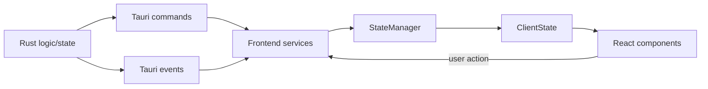
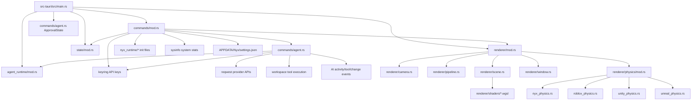
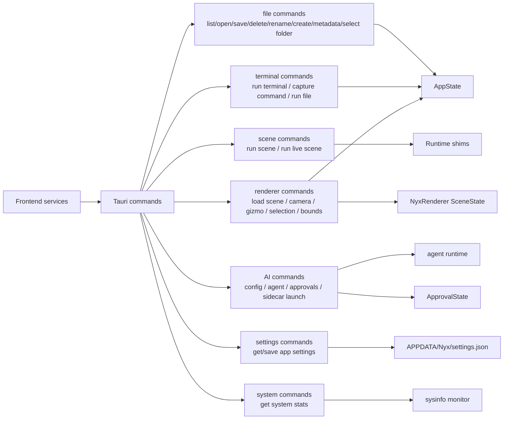
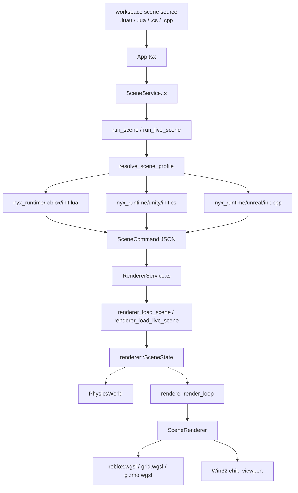
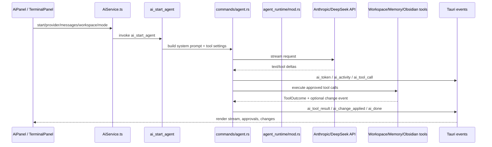
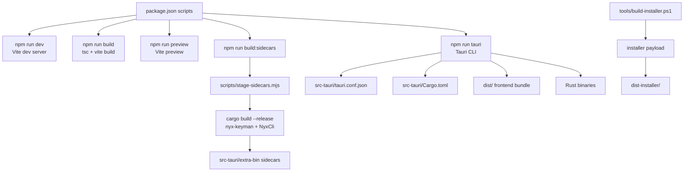
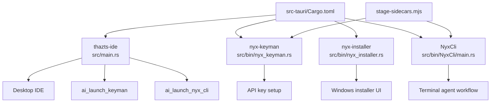
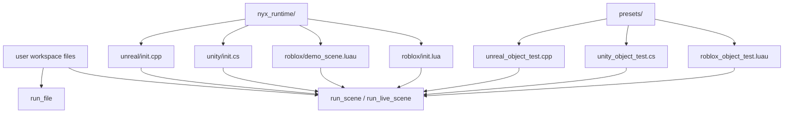

# Nyx Project Diagrams

These diagrams map the source-side project structure. Generated installer payloads, compiled binaries, and copied runtime payloads are intentionally excluded from the dependency graph.

## Workspace Map

```mermaid
flowchart TD
    Root["Nyx workspace"]

    Root --> Frontend["src/ React + TypeScript client"]
    Root --> Backend["src-tauri/ Rust + Tauri backend"]
    Root --> Runtime["nyx_runtime/ engine shims"]
    Root --> Presets["presets/ object test scripts"]
    Root --> Scripts["scripts/ Node build helpers"]
    Root --> Tools["tools/ PowerShell installer tools"]
    Root --> Media["media/ static assets"]
    Root --> Installer["installer/ installer docs"]

    Root --> ViteConfig["vite.config.ts"]
    Root --> TsConfig["tsconfig.json / tsconfig.node.json"]
    Root --> Package["package.json / package-lock.json"]
    Root --> TauriConfig["src-tauri/tauri.conf.json"]
    Root --> Cargo["src-tauri/Cargo.toml / Cargo.lock"]

    Frontend --> MainTsx["main.tsx"]
    Frontend --> AppTsx["App.tsx"]
    Frontend --> Components["components/*.tsx"]
    Frontend --> Services["services/*.ts"]
    Frontend --> State["state/*.ts"]
    Frontend --> Styles["styles/*.css"]
    Frontend --> UiLib["ui/UILib.ts"]
    Frontend --> DevtoolsStub["devtools-stub/index.ts"]

    Backend --> RustMain["src/main.rs"]
    Backend --> Commands["src/commands/"]
    Backend --> AppState["src/state/mod.rs"]
    Backend --> Renderer["src/renderer/"]
    Backend --> AgentRuntime["src/agent_runtime/"]
    Backend --> Bins["src/bin/"]
    Backend --> BuildRs["build.rs"]

    Scripts --> StageSidecars["stage-sidecars.mjs"]
    Tools --> BuildInstaller["build-installer.ps1"]
```

## Framework Data River

## Frontend Dependency Graph

```mermaid
flowchart TD
    Main["src/main.tsx"] --> App["src/App.tsx"]

    App --> ActivityBar["ActivityBar.tsx"]
    App --> Sidebar["Sidebar.tsx"]
    App --> EditorArea["EditorArea.tsx"]
    App --> ViewportTab["ViewportTab.tsx"]
    App --> TerminalPanel["TerminalPanel.tsx"]
    App --> StatusBar["StatusBar.tsx"]
    App --> PropertiesBar["PropertiesBar.tsx"]
    App --> StartScreen["StartScreen.tsx"]
    App --> SourceControl["SourceControl.tsx"]
    App --> SettingsPanel["SettingsPanel.tsx"]
    App --> CommandPalette["CommandPalette.tsx"]
    App --> DevMenu["@devtools alias"]

    App --> FileService["FileService.ts"]
    App --> EditorService["EditorService.ts"]
    App --> CaptureService["CaptureService.ts"]
    App --> RunService["RunService.ts"]
    App --> SceneService["SceneService.ts"]
    App --> RendererService["RendererService.ts"]
    App --> StateService["StateService.ts"]
    App --> NativeCommands["NativeCommands.ts"]
    App --> EngineProfiles["EngineProfiles.ts"]
    App --> Tokenizer["Tokenizer.ts"]
    App --> UILib["UILib.ts"]

    TerminalPanel --> AiPanel["AiPanel.tsx"]
    AiPanel --> AiService["AiService.ts"]
    AiPanel --> StateService
    SourceControl --> GitService["GitService.ts"]
    SettingsPanel --> AiService
    SettingsPanel --> FileService
    PropertiesBar --> RendererService
    PropertiesBar --> StateService
    PropertiesBar --> UseStateKey["useStateKey.ts"]
    ViewportTab --> RendererService
    ViewportTab --> StateService
    EditorArea --> HighlightOverlay["HighlightOverlay.tsx"]
    EditorArea --> Tokenizer
    EditorArea --> TerminalTokenizer["TerminalTokenizer.ts"]
    Tokenizer --> TokenizerWorker["Tokenizer.worker.ts"]

    StateService --> StateManager["StateManager.ts"]
    StateManager --> ClientState["ClientState.ts"]
    UseStateKey --> ClientState

    FileService --> TauriInvoke["@tauri invoke"]
    EditorService --> TauriInvoke
    CaptureService --> TauriInvoke
    RunService --> TauriInvoke
    SceneService --> TauriInvoke
    RendererService --> TauriInvoke
    AiService --> TauriInvoke
    SystemService["SystemService.ts"] --> TauriInvoke
```

## Backend Dependency Graph

## Tauri Command Surface

## Renderer And Scene Pipeline

## AI Agent Pipeline

## Build And Packaging Flow

## Rust Binaries

## Runtime Script Inputs

