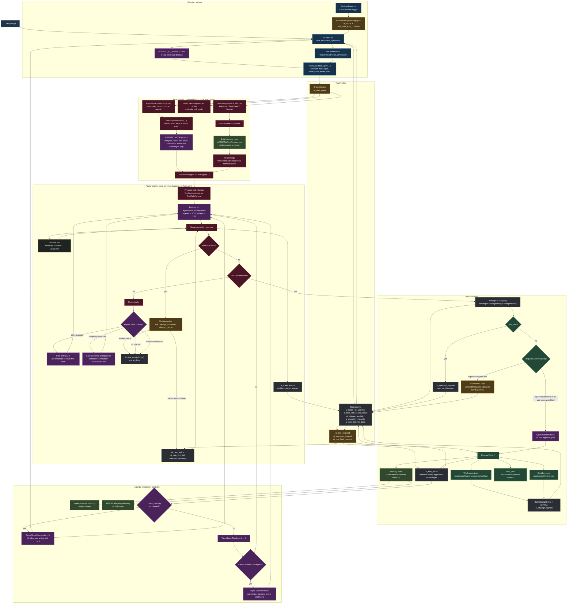

# Nyx Agent Mode Mermaid Diagram

```mermaid
%%{init: {'flowchart': {'nodeSpacing': 22, 'rankSpacing': 34, 'curve': 'basis'}}}%%
flowchart TD
    classDef userStyle fill:#243447,stroke:#6CA6D9,stroke-width:1px,color:#EAF4FF;
    classDef frontendStyle fill:#17324D,stroke:#5DADE2,stroke-width:1px,color:#E8F4FF;
    classDef bridgeStyle fill:#4E3B17,stroke:#D6A94A,stroke-width:1px,color:#FFF6D8;
    classDef backendStyle fill:#4A1525,stroke:#E76F8A,stroke-width:1px,color:#FFEAF0;
    classDef agenticStyle fill:#4A235A,stroke:#BB8FCE,stroke-width:2px,color:#F8EEFF;
    classDef toolStyle fill:#244837,stroke:#52BE80,stroke-width:1px,color:#E8F8F0;
    classDef memoryStyle fill:#31472E,stroke:#8CC16E,stroke-width:1px,color:#F0FFE8;
    classDef externalStyle fill:#1F2421,stroke:#95A5A6,stroke-width:1px,stroke-dasharray:5 5,color:#EAEDED;
    classDef eventStyle fill:#2A2D34,stroke:#A2A7B5,stroke-width:1px,color:#FFFFFF;

    User["User prompt"]:::userStyle

    subgraph Frontend["React AI surface"]
        SettingsPanel["SettingsPanel.tsx\nDefault Mode toggle"]:::frontendStyle
        AppSettings["APPDATA/Nyx/settings.json\nai_mode + rate_limit_auto_continue"]:::bridgeStyle
        AiPanel["AiPanel.tsx\nchat, task cards, approvals"]:::frontendStyle
        AgenticUiInstruction["AGENTIC_UI_INSTRUCTION\n4-step slice card protocol"]:::agenticStyle
        SkillResolverUi["Skill intent filters\nFengshui/SelfHelp/Lua/Viewport"]:::frontendStyle
        AiService["AiService.StartAgent(...)\nprovider, messages, workspace, mode, skills"]:::frontendStyle
    end
    subgraph TauriBridge["Tauri bridge"]
        InvokeStart["@tauri invoke\nai_start_agent"]:::bridgeStyle
        EventBus["Tauri events\nai_token / ai_activity / ai_tool_call / ai_tool_result\nai_change_applied / ai_question_request / ai_rate_limit / ai_done"]:::eventStyle
        ApprovalReplies["ai_tool_respond\nai_question_respond\nai_rate_limit_respond"]:::bridgeStyle
    end

    subgraph Startup["Rust startup: commands/mod.rs::ai_start_agent"]
        ProviderKey["Resolve provider + API key\nAnthropic / DeepSeek / OpenAI"]:::backendStyle
        PersistProvider["Persist default provider"]:::backendStyle
        MemoryRoots["Build memory roots\nAPPDATA/Nyx/NyxMemory\nworkspace/.nyx/memory"]:::memoryStyle
        ToolSettings["ToolSettings\nworkspace, obsidian vault, memory paths"]:::backendStyle
        SkillResolve["skills::Resolve(selected skills)\nload safe skill blocks"]:::backendStyle
        AgentModeParse["AgentMode::FromStr(mode)\nsupervised / autonomous / agentic"]:::backendStyle
        SystemPrompt["BuildSystemPrompt(...)\nbase rules + skills + mode rules"]:::backendStyle
        AgenticPrompt["AGENTIC MODE prompt\none plan, slices of 4 steps,\ncheckpoint after each meaningful step"]:::agenticStyle
        RunAgent["commands/agent.rs::RunAgent(...)"]:::backendStyle
    end

    subgraph AgentLoop["Agent runtime loop: commands/agent.rs::RunAgent"]
        ToolDefs["Provider tool schema\nToolDefsAnthropic or ToolDefsOpenai"]:::backendStyle
        Iteration["Loop up to AgentMode.MaxIterations\nagentic = 1000, others = 100"]:::agenticStyle
        StreamCall["Stream provider response"]:::backendStyle
        ProviderCloud["Provider API\nAnthropic / OpenAI / DeepSeek"]:::externalStyle
        TokenStream["ai_token events\nvisible assistant stream"]:::eventStyle
        ToolCalls{"Tool calls returned?"}:::backendStyle
        NoTools["No tool calls"]:::backendStyle
        SliceMarker{"Agentic slice marker?"}:::agenticStyle
        PlanOnlyGuard["Plan-only guard\nask model to execute first slice"]:::agenticStyle
        SliceComplete["Slice complete or replanned\ncontroller continuation starts next slice"]:::agenticStyle
        Finish["Emit ai_activity(done)\nand ai_done"]:::eventStyle
        RateLimit{"Rate limit error?"}:::backendStyle
        RateLimitPolicy["Settings policy\nask / always_continue / always_cancel"]:::bridgeStyle
        RateLimitWait["ai_rate_limit + ai_rate_limit_tick\nwait 60s, then retry"]:::eventStyle
    end

    subgraph ToolExecution["Tool execution"]
        ActivityForTool["ActivityForTool(tool)\nreading/searching/editing/running/memory"]:::eventStyle
        QuestionTool{"ask_user?"}:::toolStyle
        QuestionUi["ai_question_request\nwait for UI answer"]:::eventStyle
        ApprovalCheck{"RequiresApproval(tool)?"}:::toolStyle
        SupervisedOnly["Supervised only:\nwrite/edit/run/write_obsidian need approval"]:::bridgeStyle
        AgenticAuto["Agentic/autonomous:\nno tool approval gate"]:::agenticStyle
        ExecuteTool["ExecuteTool(...)"]:::toolStyle
        WorkspaceTools["Workspace tools\nread/search/summarize/write/edit/run"]:::toolStyle
        NotesTools["Obsidian tools\nread/search/write notes"]:::toolStyle
        MemoryTools["Memory tools\ncreate/search/list/read memory"]:::memoryStyle
        SkillTools["read_skill\nload full selected skill content"]:::toolStyle
        ChangePreview["BuildChangeEvent + preview\nai_change_applied"]:::eventStyle
        ToolResult["ai_tool_result\ntrimmed history appended to messages"]:::eventStyle
    end

    subgraph Checkpointing["Agentic checkpoint controller"]
        Checkpoint{"create_memory succeeded?"}:::agenticStyle
        ResetCounter["TurnsSinceCheckpoint = 0\nUI advances active task card"]:::agenticStyle
        IncrementCounter["TurnsSinceCheckpoint += 1"]:::agenticStyle
        ForceCheckpoint{"4 turns without checkpoint?"}:::agenticStyle
        InjectCheckpoint["Inject user reminder:\ncall create_memory before continuing"]:::agenticStyle
        ProjectMemory["workspace/.nyx/memory\nproject scope"]:::memoryStyle
        GlobalMemory["APPDATA/Nyx/NyxMemory\nglobal scope"]:::memoryStyle
    end

    User --> AiPanel
    SettingsPanel --> AppSettings
    AppSettings --> AiPanel
    AiPanel --> AgenticUiInstruction
    AiPanel --> SkillResolverUi
    AgenticUiInstruction --> AiService
    SkillResolverUi --> AiService
    AiService --> InvokeStart
    InvokeStart --> ProviderKey --> PersistProvider --> MemoryRoots --> ToolSettings
    InvokeStart --> AgentModeParse
    InvokeStart --> SkillResolve
    AgentModeParse --> SystemPrompt
    SkillResolve --> SystemPrompt
    SystemPrompt --> AgenticPrompt
    AgenticPrompt --> RunAgent
    ToolSettings --> RunAgent

    RunAgent --> ToolDefs --> Iteration
    Iteration --> StreamCall --> ProviderCloud --> StreamCall
    StreamCall --> TokenStream --> EventBus --> AiPanel
    StreamCall --> RateLimit
    RateLimit -- yes --> RateLimitPolicy
    RateLimitPolicy -- always cancel --> Finish
    RateLimitPolicy -- ask or auto continue --> RateLimitWait --> StreamCall
    ApprovalReplies --> RateLimitWait
    RateLimit -- no --> ToolCalls

    ToolCalls -- no --> NoTools --> SliceMarker
    SliceMarker -- no final text --> Finish
    SliceMarker -- active/blocked/final --> Finish
    SliceMarker -- planning only --> PlanOnlyGuard --> Iteration
    SliceMarker -- complete/replanned --> SliceComplete --> Iteration

    ToolCalls -- yes --> ActivityForTool --> EventBus
    ActivityForTool --> QuestionTool
    QuestionTool -- yes --> QuestionUi --> EventBus --> ApprovalReplies
    ApprovalReplies --> ToolResult
    QuestionTool -- no --> ApprovalCheck
    ApprovalCheck -- supervised gated tool --> SupervisedOnly --> EventBus --> ApprovalReplies
    ApprovalReplies --> ExecuteTool
    ApprovalCheck -- agentic/autonomous or safe supervised tool --> AgenticAuto --> ExecuteTool

    ExecuteTool --> WorkspaceTools
    ExecuteTool --> NotesTools
    ExecuteTool --> MemoryTools
    ExecuteTool --> SkillTools
    WorkspaceTools --> ChangePreview --> EventBus
    NotesTools --> ChangePreview
    ExecuteTool --> ToolResult --> EventBus --> AiPanel
    ToolResult --> Checkpoint

    MemoryTools --> ProjectMemory
    MemoryTools --> GlobalMemory
    Checkpoint -- yes --> ResetCounter --> AiPanel
    Checkpoint -- no --> IncrementCounter --> ForceCheckpoint
    ForceCheckpoint -- yes --> InjectCheckpoint --> Iteration
    ForceCheckpoint -- no --> Iteration
    ResetCounter --> Iteration
```
